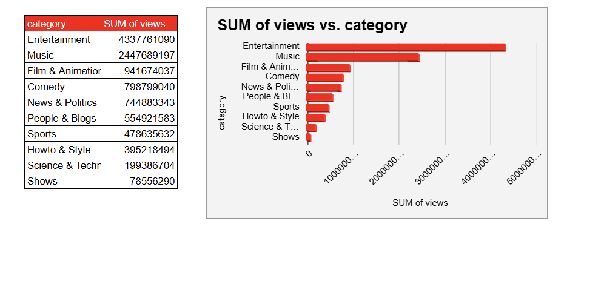
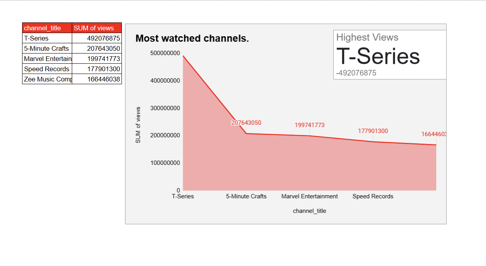

# Youtube Data Analysis 
A complete google sheet based project  

## Problem Statement:
To analyze video data repository to gain valuable insights into content performance, viewer behavior, and trends across different categories.
## Objective:
To analyze which types of content are most engaging, how viewing patterns change over time, and which channels lead in viewership.

## Tool Used 
Google sheet 

## Dashboard 

## Findings:
#### Question 1: Top 10 categories with highest number of views.

#### Question 2: Top 5 categories with highest number of video.

#### Question 3: Details of video with highest number of views.

#### Question 4: Average views for each month.

#### Question 5: Average views for each channel title.

#### Question 6: Sum of views by each category 

#### Question 7: On which date maximum number of videos is published.

#### Question 8 :Most watched channels.

